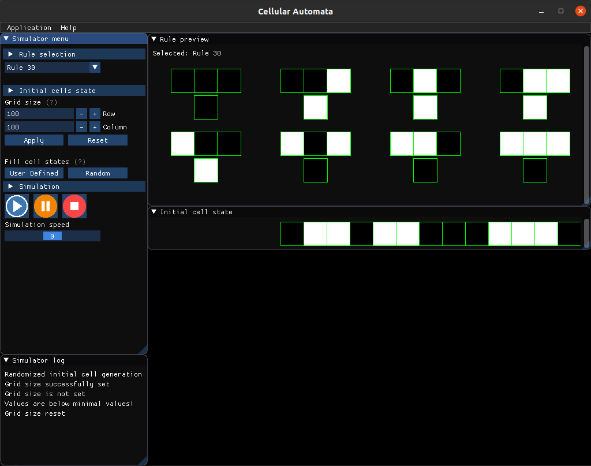
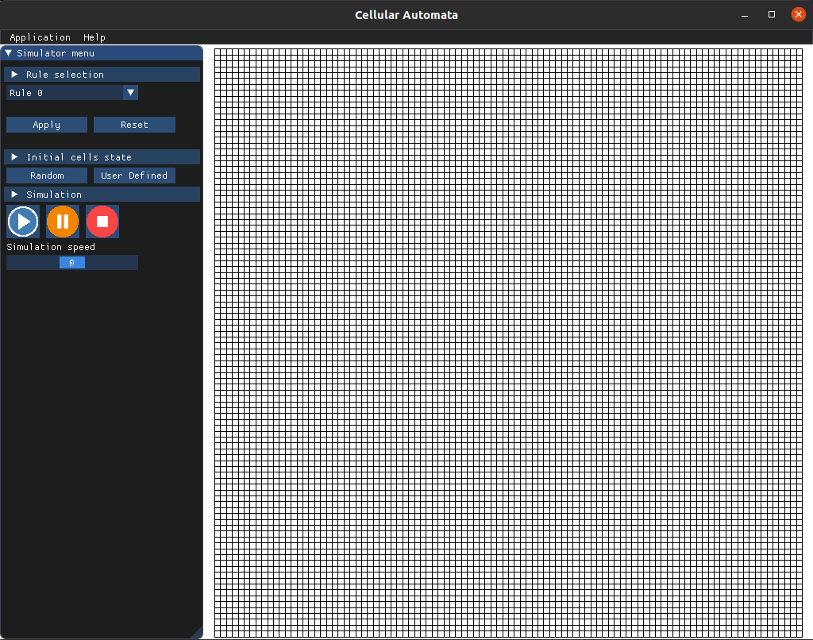
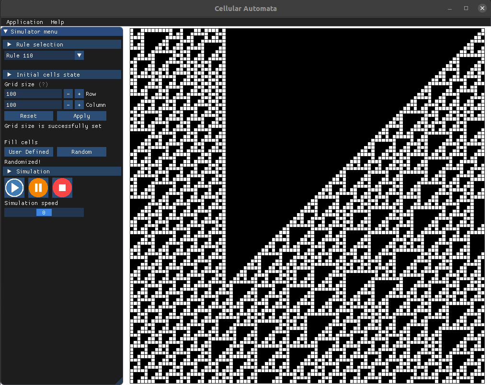

## Currently supported on Ubuntu 20.04 and Manjaro 20.1.2

# GameOfLife

Game of life implemented with the cellular automaton algorithm.

Used libraries:
- [fmt](https://github.com/fmtlib/fmt)
- [Google Test](https://github.com/google/googletest)
- [imgui](https://github.com/ocornut/imgui)
- [imgui-sfml](https://github.com/eliasdaler/imgui-sfml) (Integrated into imgui)

### Setup

Build system used in this project is [Bazel](https://www.bazel.build/). The installation instructions can be found 
[here](https://docs.bazel.build/versions/master/install-ubuntu.html).

Install the following dependencies in order to compile the project on Ubuntu 20.04:

```
sudo apt install -y build-essential libsfml-dev libcurl4-openssl-dev libglew-dev libglfw3-dev libglfw3 freeglut3-dev
```

On Manjaro 20.1.2:

```
yay -S git clang bazel sfml glfw-wayland glew
```

### Preview

Still in development, but here is a sneak peak.

* Main menu


* Main menu - Simulation parameters set


* Simulation screen - Rule 149 with grid size 50x50


### ToDo

* Simulation speed

### Dedication
To my dear friend, Kazimir, who ignited me with the spark of scientific curiosity to unravel the universe and figure out it's internal workings.
Thank you for your many interesting and educational lessons. 
