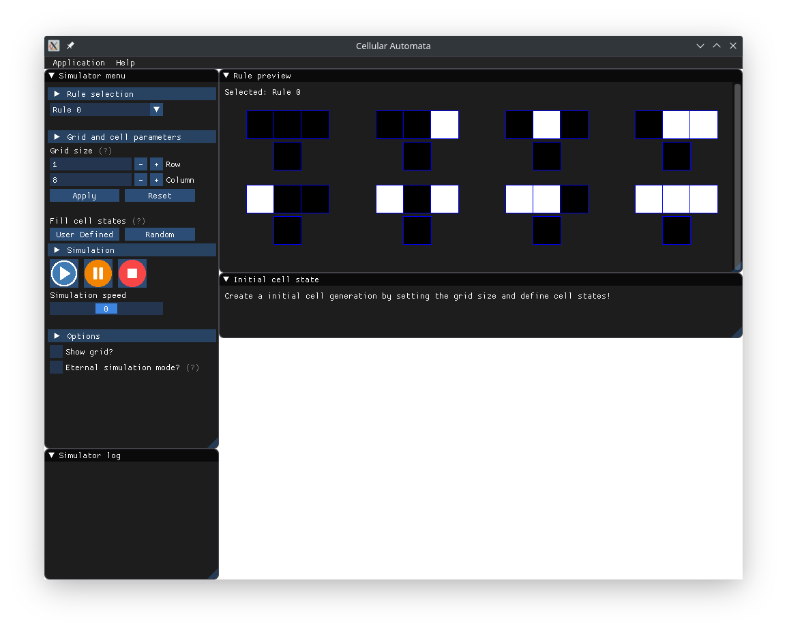
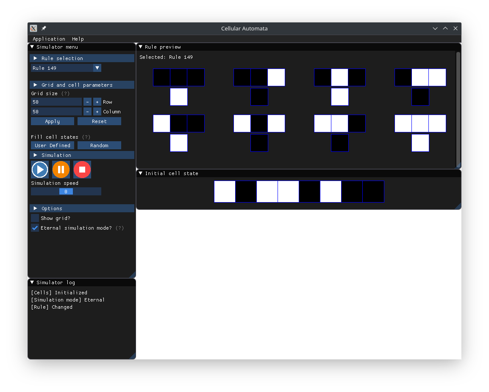
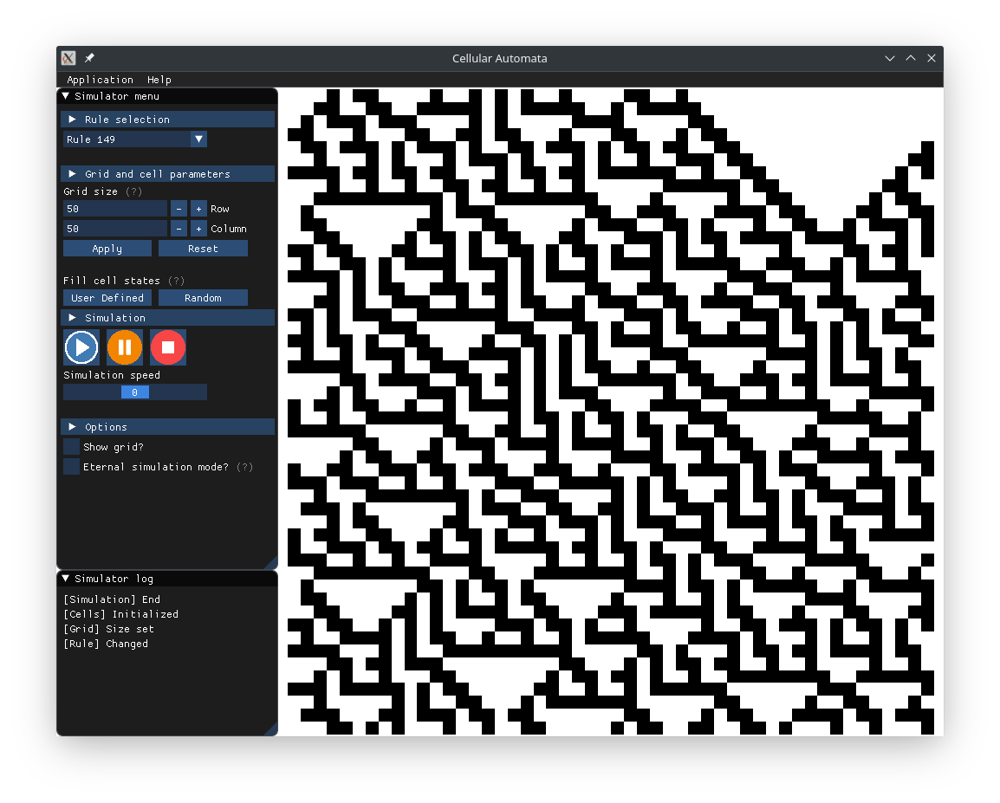

# GameOfLife

Game of life implemented with the cellular automaton algorithm.

Used libraries:
- [fmt](https://github.com/fmtlib/fmt)
- [Google Test](https://github.com/google/googletest)
- [imgui](https://github.com/ocornut/imgui)
- [imgui-sfml](https://github.com/eliasdaler/imgui-sfml) (Integrated into imgui)

### Setup

Build system used in this project is [Bazel](https://www.bazel.build/). The installation instructions can be found 
[here](https://docs.bazel.build/versions/master/install-ubuntu.html).

Install the following dependencies in order to compile the project:

```
sudo apt install -y build-essential libsfml-dev libcurl4-openssl-dev libglew-dev libglfw3-dev libglfw3 freeglut3-dev
```

### Preview

Still in development, but here is a sneak peak.

* Main menu


* Simulation screen - grid size 100x100 with the completed simulation.


* Simulation screen - grid size 2x20 and state changing grid cells



